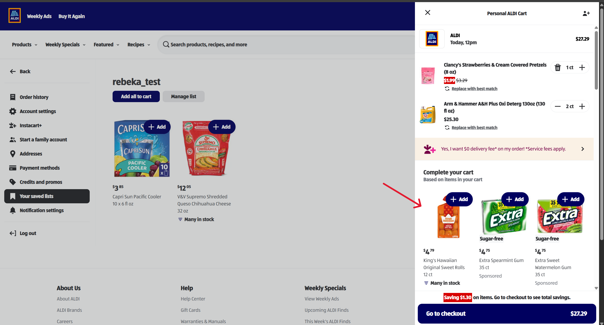
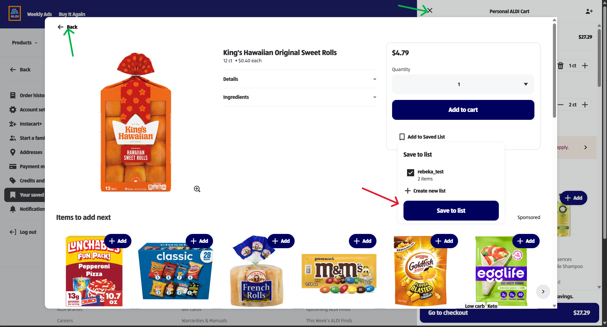
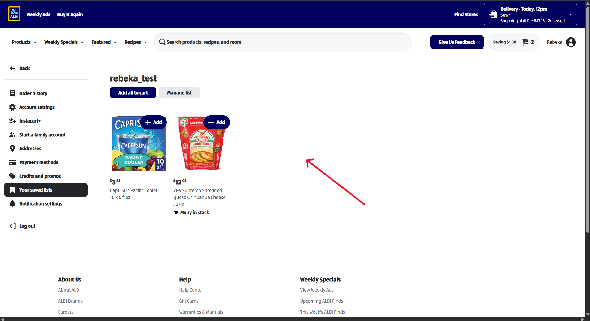
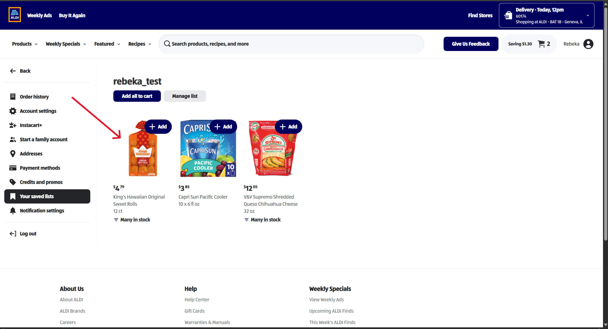
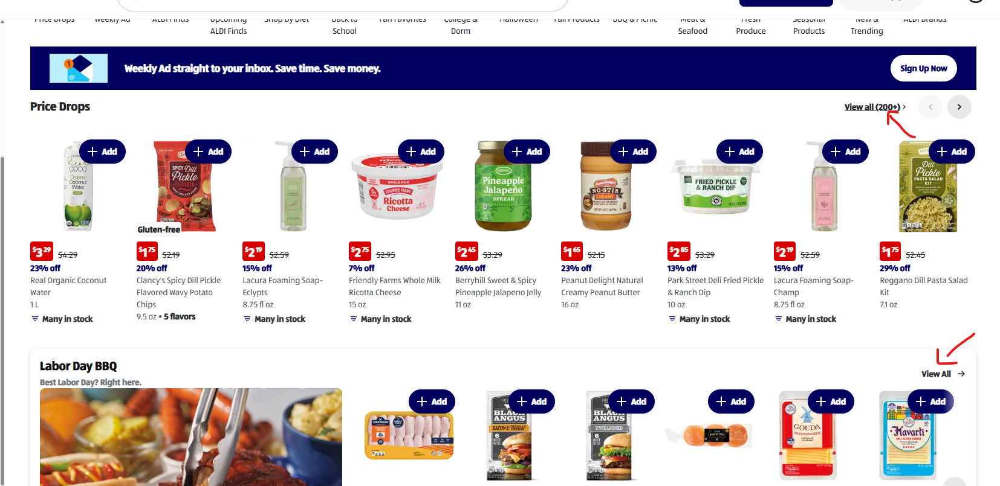
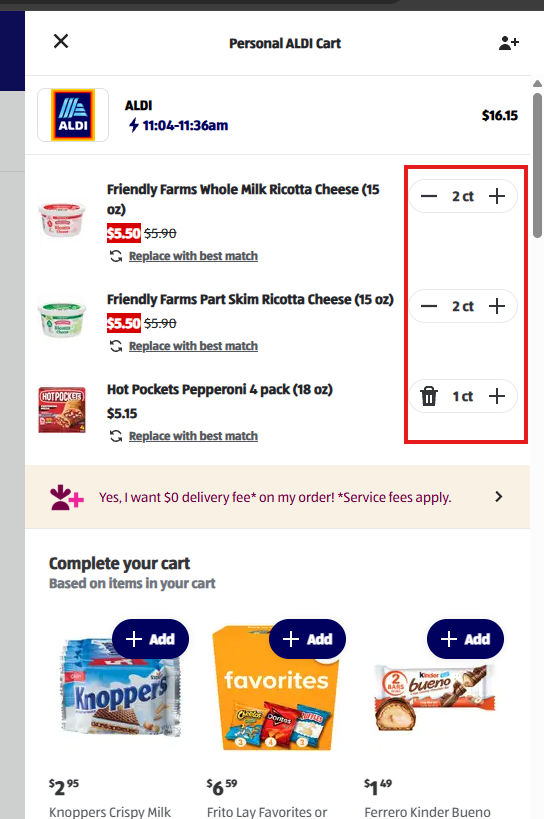
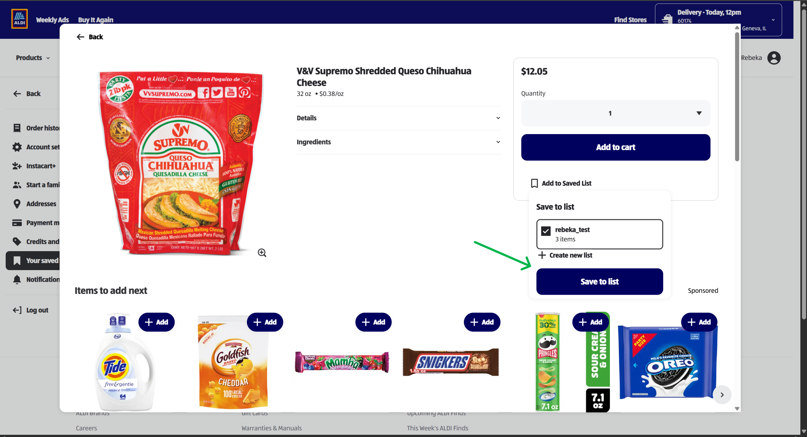
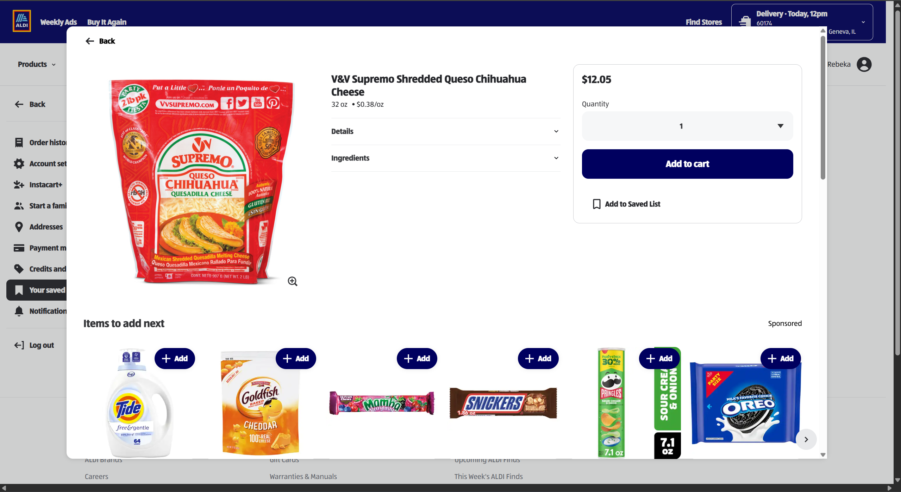

# Task 1: Manual Testing — "Add to Shopping List" Feature (ALDI US)

> **Note on terminology:** on the live ALDI US site, the feature described in the assignment as "Add to Shopping List" corresponds to the site's **Saved List** feature (accessible via a product's "Add to Saved List" action and viewable under Profile → "Your saved lists"). This document uses "saved list" throughout to match the actual UI.

## Test Cases

Fields used for each test case:

- **ID** — unique identifier
- **Title** — short description of the scenario
- **Preconditions** — state required before executing the test
- **Test Steps** — numbered actions to perform
- **Test Data** — specific inputs used
- **Expected Result** — what should happen if the feature works correctly
- **Priority** — High / Medium / Low, based on user impact
- **Type** — Positive / Negative
- **Status** — result of executing the test: **Pass** (actual result matched expected, no bug found), **Fail** (see linked bug report), or **Blocked** (could not be executed)

---

### TC01 — Add a product to an existing saved list and verify it appears under "Your saved lists"

| Field | Value |
|---|---|
| Preconditions | User is logged in; user has already created at least one saved list |
| Test Steps | 1. On the homepage, click on a random product to open its product modal. 2. Click "Add to Saved List". 3. Select the previously created saved list from the list of options. 4. Click "Save to List". 5. Click the back arrow to return to the homepage. 6. Click on the user profile icon. 7. From the profile menu, select "Your saved lists". 8. Locate the saved product and increase its quantity within the saved list. 9. Open the cart and check whether the quantity of the same product in the cart changed. |
| Test Data | A random product selected from the homepage; an existing saved list |
| Expected Result | After saving, the product appears under the selected saved list when viewed via "Your saved lists". *(Step 8–9 outcome intentionally left open — see note below.)* |
| Priority | High |
| Type | Positive |
| Status | **Pass** — actual result matched the expected result; no bug found during execution. |

**Why this matters:** this confirms the core "save" flow actually persists the item to the correct list and that it's retrievable afterward — the most fundamental behavior the feature needs to get right before edge cases (duplicates, stock status, persistence) are worth testing.

**Note / Clarification Needed:** during execution, increasing a product's quantity within the saved list also increased the quantity of the same product in the cart. There is no documented specification defining whether this is the intended behavior. Two reasonable interpretations exist:
- The saved list is meant to directly mirror/drive cart quantities (i.e. it acts as a shortcut into the cart), in which case this behavior is correct.
- The saved list is meant to be an independent list that can later be transferred to the cart as a separate action, in which case quantity changes within the list should NOT silently affect the cart.

This should be clarified with the product owner/BA before deciding whether this is expected behavior or worth reporting as a bug.

---

### TC02 — Remove a product from a saved list

| Field | Value |
|---|---|
| Preconditions | User is logged in; user has an existing saved list |
| Test Steps | 1. On the homepage, click on a random product to open its product modal. 2. Click "Add to Saved List". 3. Select the previously created saved list. 4. Click "Save to List". 5. Click the back arrow to return to the homepage. 6. Select a different product on the homepage and open its product modal. 7. Click "Add to Saved List". 8. Select the same saved list. 9. Click "Save to List". 10. Click the back arrow to return to the homepage. 11. Click the user profile icon. 12. Select "Your saved lists". 13. Click "Show all (…) items". 14. Click "Manage list". 15. Select "Remove items". 16. In the "Edit list" view, click the trash icon next to one of the products. 17. Click "Done". |
| Test Data | Two different products selected from the homepage; an existing saved list |
| Expected Result | The user is able to remove a product from the saved list via "Manage list" → "Remove items", without it affecting the cart. |
| Priority | High |
| Type | Positive |
| Status | **Pass** — actual result matched the expected result; no bug found during execution. |

**Why this matters:** the ability to remove an item is a basic counterpart to adding one — this confirms that removal is possible and discoverable, even though it lives behind an extra "Manage list" step rather than being available directly from the list view.

---

### TC03 — Saved list persistence after logout/login and in a new (incognito) session

| Field | Value |
|---|---|
| Preconditions | User is logged in; user has an existing saved list |
| Test Steps | 1. On the homepage, click on a random product to open its product modal. 2. Click "Add to Saved List". 3. Select the previously created saved list. 4. Click "Save to List". 5. Click the user profile icon. 6. Click "Log out". 7. Log back in with the same account. 8. Click the user profile icon. 9. Select "Your saved lists" and verify the product is still present. 10. Close the browser. 11. Open the site (https://www.aldi.us) in an incognito/private window. 12. Log in with the same account. 13. Click the user profile icon. 14. Select "Your saved lists" and verify the product is still present. |
| Test Data | A random product selected from the homepage; an existing saved list |
| Expected Result | The added product remains on the saved list both after logging out and back in, and when accessed from a brand-new (incognito) browser session — confirming the list is persisted server-side, tied to the account, rather than held in local/temporary browser state. |
| Priority | Medium |
| Type | Positive / state management |
| Status | **Pass** — actual result matched the expected result; no bug found during execution. |

**Why this matters:** state/persistence bugs (item silently lost on logout or in a fresh session) are high-impact but easy to miss if testing only checks the immediate UI response right after clicking "Add".

---

## Bug Report

Fields used:

- **Bug ID** — unique identifier
- **Title** — short, descriptive summary
- **Environment** — browser, OS, device, URL
- **Preconditions**
- **Steps to Reproduce**
- **Expected Result**
- **Actual Result**
- **Severity** — impact on the system (Critical / Major / Minor / Trivial)
- **Priority** — urgency of fixing (High / Medium / Low)
- **Attachments** — screenshot / video / console log

### BUG-001

| Field | Value |
|---|---|
| Bug ID | BUG-001 |
| Title | Saved list view does not refresh automatically after adding a product from the cart drawer's suggested items |
| Environment | Chrome 128, Windows 11, https://www.aldi.us |
| Preconditions | User is logged in; user is viewing "Your saved lists" |
| Steps to Reproduce | 1. While on the "Your saved lists" screen, click the cart icon to open the cart drawer (slides in from the right, saved list visible underneath). 2. In the "Complete your cart" suggested items section, click on a suggested product to open its product modal. 3. In the product modal, click "Add to Saved List". 4. Click the back arrow to return to the cart drawer. 5. Click the "X" button to close the cart drawer and return to the saved list screen. |
| Expected Result | The saved list screen updates automatically to show the newly added product, without requiring any further action from the user. |
| Actual Result | The newly added product does not appear in the saved list view after closing the cart drawer. The product only appears after manually refreshing the browser page. |
| Severity | Minor (no data loss — the item is actually saved server-side — but the UI gives the false impression that the add failed, which could lead the user to add the item again) |
| Priority | Medium |
| Attachments | screenshot_bug001_1.png, screenshot_bug001_2.png, screenshot_bug001_3.png, screenshot_bug001_4.png |

---

## Improvement Ticket (Cosmetic / UX Inconsistency)

Not every issue found during testing is a functional bug — some are inconsistencies that don't break functionality but affect UX quality and should still be tracked. Jira's standard issue type for this is **Improvement** (some teams use **Enhancement** instead), as opposed to **Bug**, which is reserved for functional defects.

Fields used (same shape as a Jira issue):

- **Issue Key** — unique identifier
- **Issue Type** — Improvement
- **Summary** — short, descriptive title
- **Environment** — browser, OS, URL
- **Description** — what is inconsistent and why it matters
- **Steps to Reproduce**
- **Expected Behavior**
- **Actual Behavior**
- **Severity** — Cosmetic (visual-only, no functional impact)
- **Priority** — Low / Medium
- **Attachments**

### Sample Improvement Ticket #1

| Field | Value |
|---|---|
| Issue Key | IMP-001 |
| Issue Type | Improvement |
| Summary | "View All" link inconsistently shows item count across storefront sections |
| Environment | Chrome 128, Windows 11, https://www.aldi.us/store/aldi/storefront |
| Description | On the storefront homepage, some product carousels show the item count next to the "View All" link (e.g. "Price Drops" → *View all (200+)*), while other sections only show the link with no count (e.g. "Labor Day BBQ" → *View All*). This is likely due to standard category carousels and seasonal/event-based promo carousels being built as different components. While not a functional defect, it creates an inconsistent UX pattern across the same page. |
| Steps to Reproduce | 1. Go to the ALDI US storefront homepage. 2. Locate the "Price Drops" section header and note the "View all (200+)" link. 3. Scroll to the "Labor Day BBQ" section header and note the "View All" link. |
| Expected Behavior | All "View All" links on the storefront follow the same pattern — either all show the item count, or none do. |
| Actual Behavior | "Price Drops" shows the count ("View all (200+)"); "Labor Day BBQ" does not ("View All"). |
| Severity | Cosmetic |
| Priority | Low |
| Attachments | screenshot_view_all_inconsistency.png |

---

### Sample Improvement Ticket #2

| Field | Value |
|---|---|
| Issue Key | IMP-002 |
| Issue Type | Improvement |
| Summary | No direct way to remove a cart item when quantity is greater than 1 |
| Environment | Chrome 128, Windows 11 (mobile cart view), https://www.aldi.us |
| Description | In the cart drawer, an item with a quantity of 1 shows a trash/delete icon next to the stepper, allowing one-click removal. However, once quantity is 2 or more, the trash icon is replaced by a "−" (decrement) control, and there is no direct way to remove the item — the user must repeatedly tap "−" to bring the quantity down to 1 before the delete option appears. This adds unnecessary friction to a common action (removing an item the user changed their mind about), especially for items with a higher quantity. |
| Steps to Reproduce | 1. Add 2 or more units of any product to the cart. 2. Open the cart drawer. 3. Attempt to remove the item directly. |
| Expected Behavior | The user should be able to remove a cart item in one action regardless of its quantity (e.g. a persistent trash icon, or a "remove item" option alongside the quantity stepper). |
| Actual Behavior | The trash icon only appears once quantity is decremented down to 1; at quantity 2+, only "−"/"+" controls are shown. |
| Severity | Cosmetic / UX friction (no functional blocker, but adds avoidable steps) |
| Priority | Medium |
| Attachments | screenshot_cart_quantity_delete.png |

---

### Sample Improvement Ticket #3

| Field | Value |
|---|---|
| Issue Key | IMP-003 |
| Issue Type | Improvement |
| Summary | "Save to list" button remains active with no feedback when the product is already on the selected list |
| Environment | Chrome 128, Windows 11, https://www.aldi.us |
| Description | When opening "Add to Saved List" for a product that is already on a given saved list, the list's checkbox is shown pre-checked (correctly indicating the product is already saved there). However, the "Save to list" button remains fully active and clickable, and clicking it again produces no toast, message, or visual feedback of any kind — nor is the button disabled to prevent the redundant action. The underlying data is not affected (the item count on the list does not change), but the UI gives no indication of that either way, leaving the user unsure whether anything happened. |
| Steps to Reproduce | 1. Add a product to a saved list. 2. Reopen the same product's modal and click "Add to Saved List" again. 3. Observe the list's checkbox is already checked. 4. Click "Save to list" again. |
| Expected Behavior | Either the "Save to list" button is disabled for lists where the product is already saved, or clicking it shows a clear message confirming the product is already on the list (or a "Removed" / "Already saved" style toast). |
| Actual Behavior | The button stays active and clickable; clicking it again gives no feedback message, though the list's item count correctly stays unchanged. |
| Severity | Cosmetic / UX clarity (no data integrity issue, but leaves the user without confirmation of the outcome) |
| Priority | Low |
| Attachments | screenshot_imp003_1.png, screenshot_imp003_2.png |

